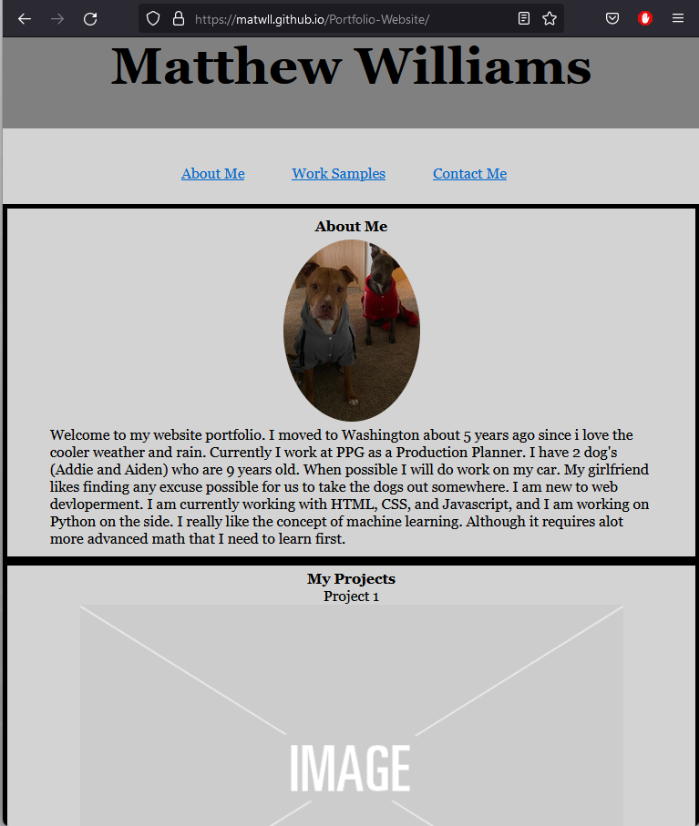

# Portfolio Website

## Description

This is my portfolio webpage for potential employers.
It showcases a few projects I have made as well as providing links to those projects.
This project solves my problem of having to print out and carry around samples of my work for potential employers.
While making this I learned alot about flexbox, divs, and mediaqueries.

## Installation

N/A

## Usage

To use this project you can open https://matwll.github.io/Portfolio-Website/ and view a little about me, some of my projects, as well as a form to contact me with.

### How to contribute

Since I am new to web delopment this website will have additional changes in the coming months. Such as making the form actually submit, replacing the placeholder 
images with actual projects and links. As well as adding some Javascript.

If you have anything you would like to suggest or contribute. Please feel free to open a pull request or create an Issue in the repository (found here: https://github.com/matwll/Portfolio-Website)
and I will we sure to review it. I also appreciate any help or feedback.

## License
Distributed under the MIT License.